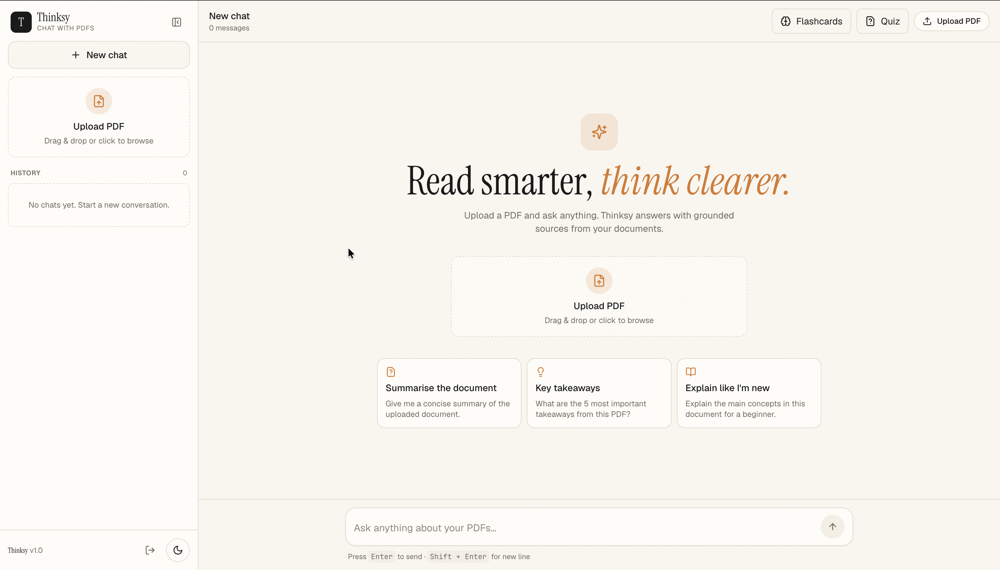
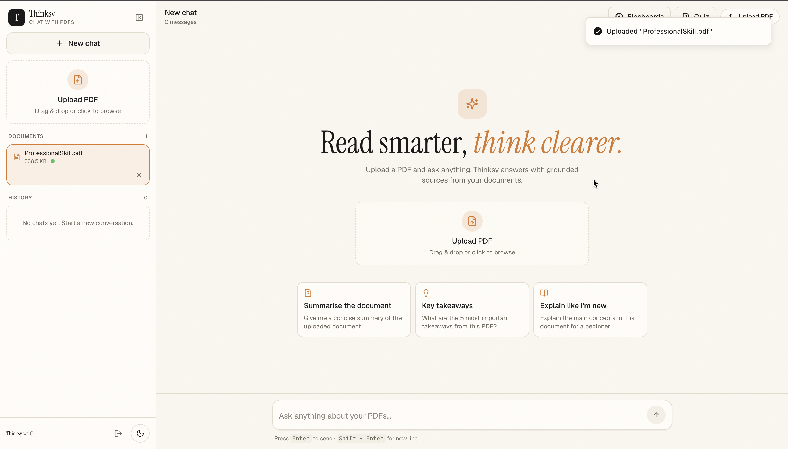
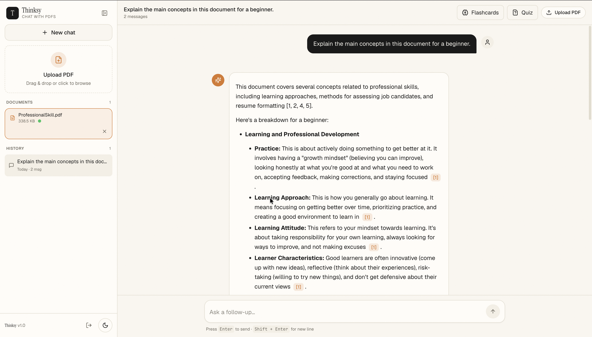
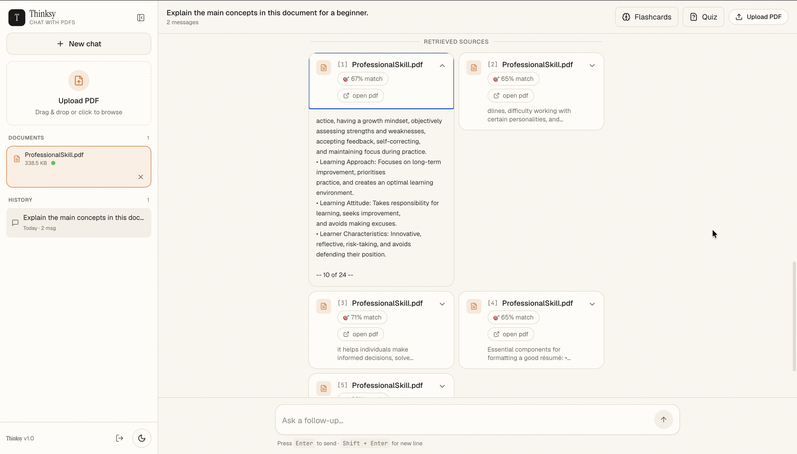
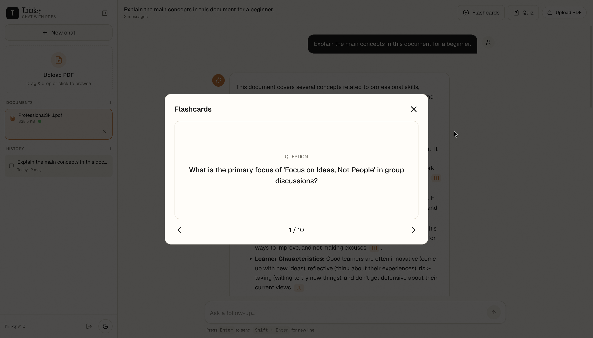
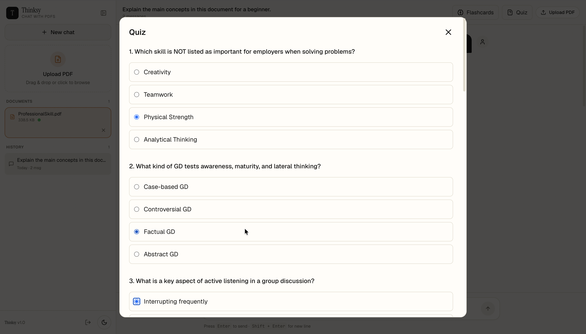
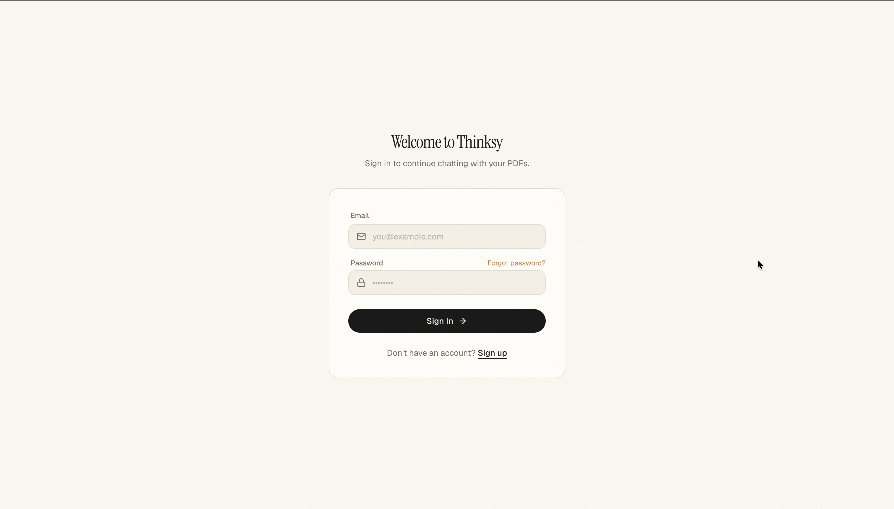
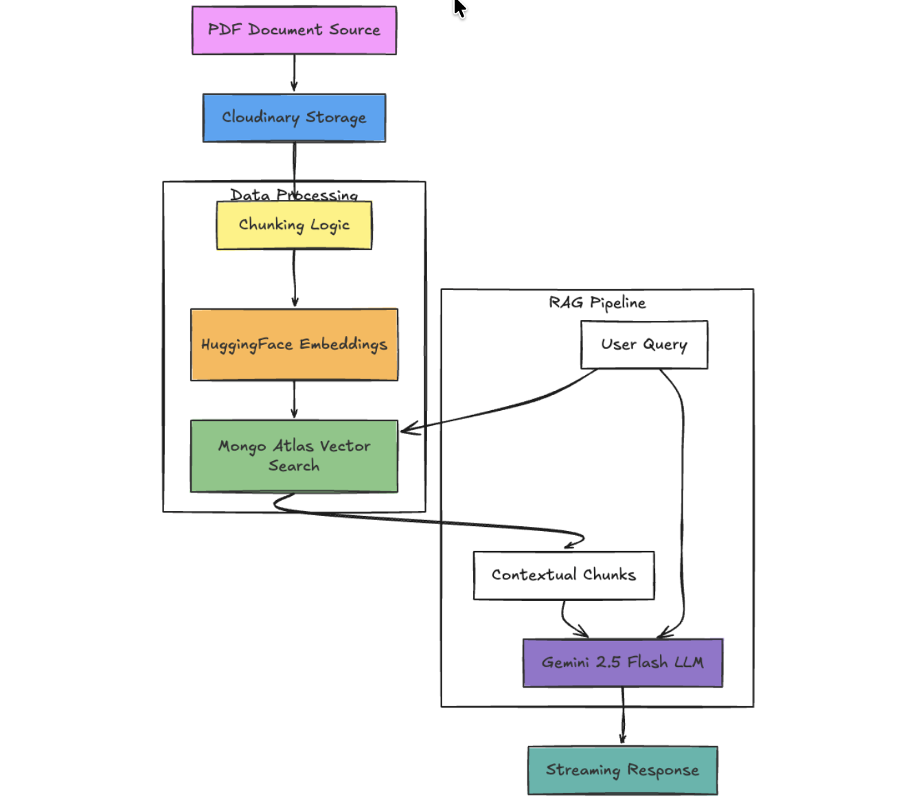

<h1 align="center">🧠 Thinksy</h1>

<div align="center">


### Transform Static PDFs into an Interactive AI Knowledge Base

Thinksy is a production-ready AI-powered PDF learning assistant that converts documents into a conversational, source-grounded knowledge base using Retrieval-Augmented Generation (RAG), MongoDB Atlas Vector Search, Google Gemini 2.5 Flash, and Hugging Face Embeddings.

<p align="center">
  <a href="https://thinksy-lime.vercel.app"><strong>🌐 Live Demo</strong></a>
  •
  <a href="https://thinksy-server.onrender.com"><strong>⚙️ Backend API</strong></a>
</p>

<p align="center">


</p>

> 🧠 **Deep Dive:** Want to understand how the RAG pipeline, SSE streaming, and MongoDB Vector Search actually work under the hood? Check out the **[PROJECT_BRAIN.md](./PROJECT_BRAIN.md)** for a complete architectural breakdown.

</div>

---

## 💡 Why Thinksy?

Standard Large Language Models suffer from two major flaws: they hallucinate facts, and they cannot read your private documents. **Thinksy solves this** by using a **Retrieval-Augmented Generation (RAG)** pipeline. It mathematically slices your PDFs into vectors, searches for the exact paragraphs needed, and forces the AI to answer *only* using your data—complete with clickable source citations.

---

## ✨ Features

### 📄 Smart PDF Processing
* **Cloud Integration:** Upload PDFs directly to Cloudinary.
* **Intelligent Parsing:** Automatic text extraction using advanced PDF parsing.
* **Semantic Chunking:** Context-aware text splitting with overlap preservation.

### 🧠 AI-Powered Conversations
* **RAG Architecture:** Grounded, hallucination-resistant answers.
* **Fluid UI:** Streaming token responses via Server-Sent Events (SSE).
* **Memory:** Context-aware chat history for multi-turn conversations.

### 🔎 Source Grounding
* **Interactive Citations:** Clickable `[1] [2]` inline references.
* **Verification:** Detailed retrieved source cards with similarity scores.
* **Seamless Navigation:** Direct source-to-PDF modal viewing.

### 🔐 Security & Infrastructure
* **Authentication:** JWT-based user-isolated knowledge bases.
* **Production Ready:** Vercel (Edge) & Render (Node.js) deployments.

---

## 🏗️ System Architecture

```text
PDF Upload
    │
    ▼
Cloudinary Storage
    │
    ▼
PDF Text Extraction
    │
    ▼
Semantic Chunking
    │
    ▼
Hugging Face Embeddings
    │
    ▼
MongoDB Atlas Vector Search
    │
    ▼
Gemini 2.5 Flash
    │
    ▼
Streaming Response (SSE)
    │
    ▼
React Frontend
```

---

## 🛠 Tech Stack

### Frontend


### Backend


### AI & Retrieval


### Data Layer


### Deployment


---

## 📸 Screenshots

### 🏠 Landing Experience



### 📄 PDF Upload Workflow



### 🤖 AI Chat Experience



### 🔎 Source Citations & Retrieval



### 🎓 Flashcard Generation



### 📝 Quiz Generation



### 🔐 Authentication



### 🏗️ Architecture Diagram



---

## 🚀 Getting Started

### Clone Repository

```bash
git clone https://github.com/satyam-v3/Thinksy.git
cd Thinksy
```

### Frontend Setup

```bash
npm install
npm run dev
```

Frontend runs at:

```text
http://localhost:3000
```

### Backend Setup

```bash
cd server
npm install
npm run dev
```

Backend runs at:

```text
http://localhost:4000
```

---

## 🔑 Environment Variables

### Frontend

Create:

```env
.env
```

```env
VITE_API_URL=http://localhost:4000/api/v1
```

### Backend

Create:

```env
server/.env
```

```env
PORT=4000

MONGODB_URI=

JWT_SECRET=

OPENROUTER_API_KEY=

HF_API_KEY=

CLOUDINARY_CLOUD_NAME=
CLOUDINARY_API_KEY=
CLOUDINARY_API_SECRET=
```

---

## 📂 Project Structure

```text
Thinksy
│
├── docs/
│   └── screenshots/
│
├── src/
│   ├── components/
│   ├── context/
│   ├── hooks/
│   └── lib/
│
├── server/
│   ├── controllers/
│   ├── middleware/
│   ├── models/
│   ├── routes/
│   ├── services/
│   ├── jobs/
│   ├── utils/
│   └── lib/
│
└── PROJECT_BRAIN.md
```

---

## 🔗 Live Demo

### Frontend

https://thinksy-lime.vercel.app

### Backend

https://thinksy-server.onrender.com

---

## 🗺️ Roadmap

* [ ] Hybrid Search (BM25 + Dense Retrieval)
* [ ] Redis + BullMQ Background Jobs
* [ ] Auto Learning Artifacts Storage
* [ ] OCR for Scanned PDFs
* [ ] Multi-Modal Document Understanding
* [ ] Maximum Marginal Relevance (MMR)
* [ ] Collaborative Learning Spaces

---

## 🤝 Contributing

Contributions are welcome.

1. Fork the repository
2. Create a feature branch
3. Commit changes
4. Push to your fork
5. Open a Pull Request

---

## 👨‍💻 Author

### Satyam Kumar

* GitHub: https://github.com/satyam-v3
* Live Demo: https://thinksy-lime.vercel.app

---

<div align="center">

### ⭐ If you found this project useful, consider starring the repository.

Built with ❤️ using React, TypeScript, MongoDB Atlas, Gemini, and RAG.

</div>